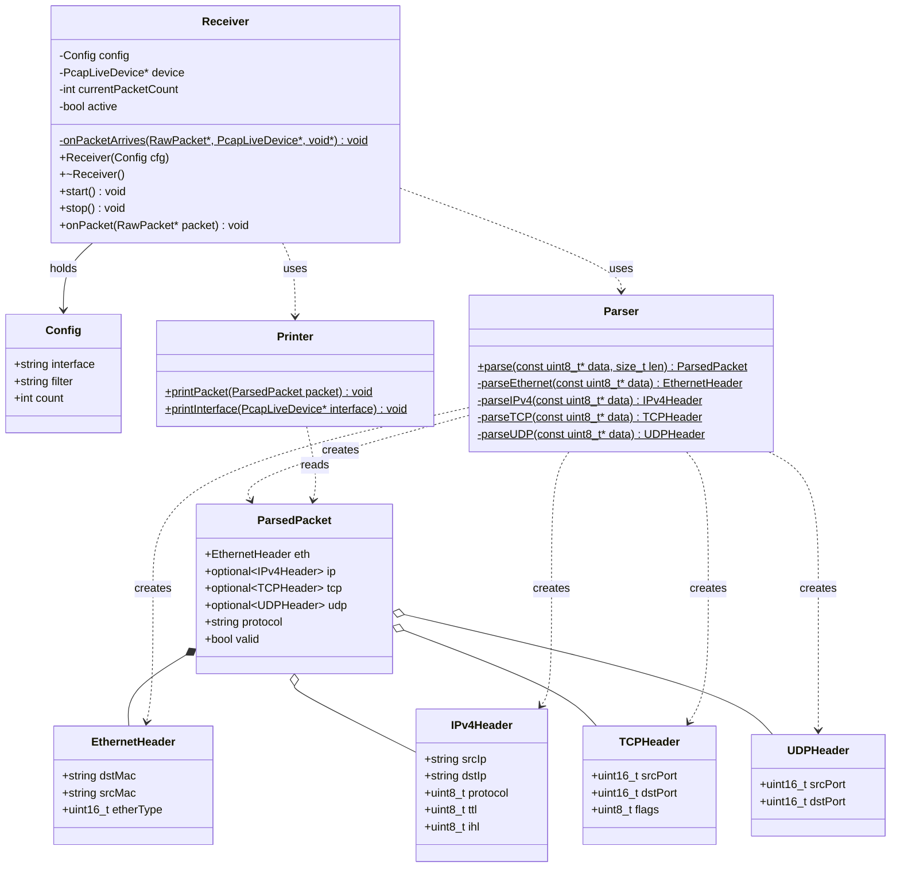
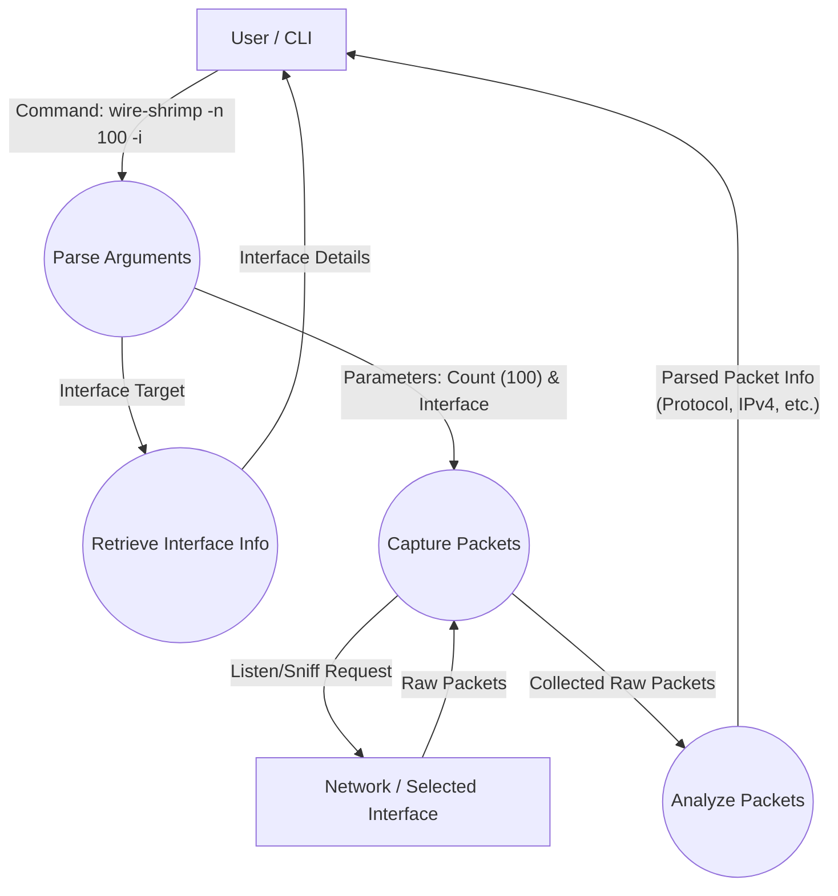

# wire-shrimp

## Building

To run the project:

`$ make && ./build/wire-shrimp`

Then executable will subesquently be found in `/build/wire-shrimp`

## Diagrams

### Class diagram

### Data flow

