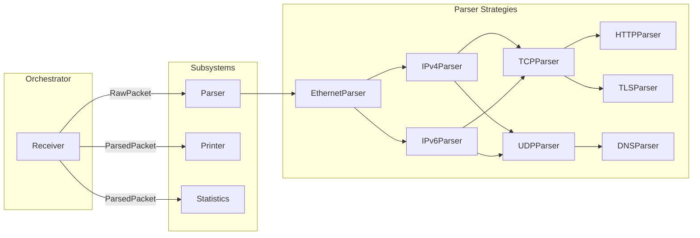
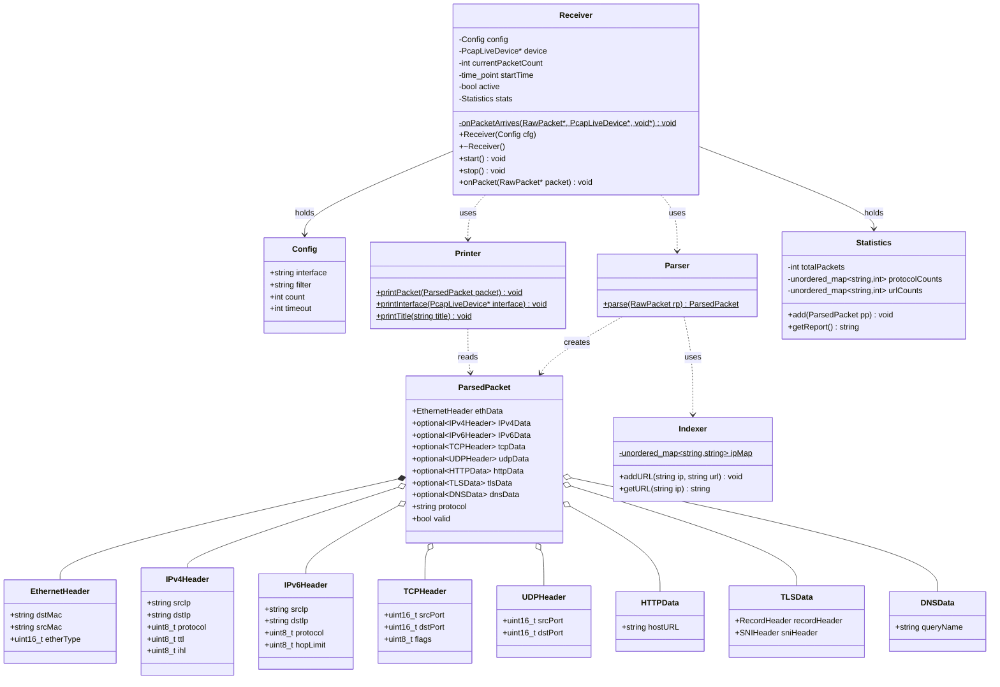
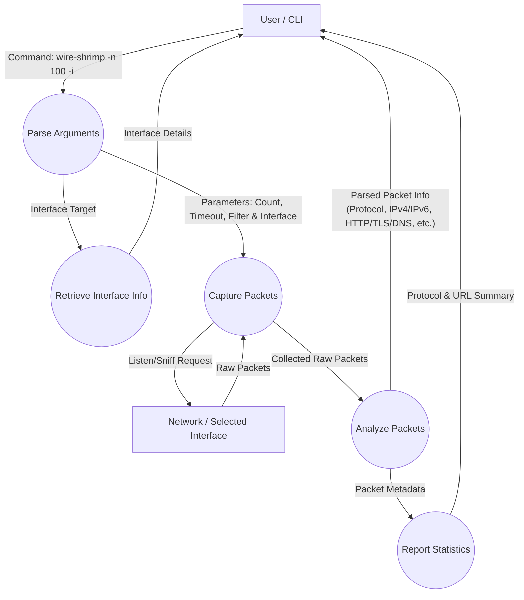
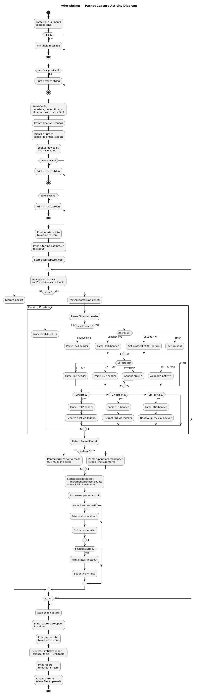

# wire-shrimp

`wire-shrimp` is a WIP simple command-line tool designed for quick network packet capture and analysis. 

## Features

 - Ability to select specific network interfaces to monitor (-i).
 - Ability to limit the number of packets captured per session (-n).
 - Ability to set a capture timeout in seconds (-t).
 - Ability to apply BPF capture filters (-f).
 - Displays configuration details for the selected network interface.
 - Parses and analyzes all layers of the network protocol to some extent (Including HTTP, HTTPS, DNS on IPv4 and protocol identification on IPv6)
 - Extracts and indexes host URLs from HTTP Host headers and TLS SNI fields.
 - Displays a per-protocol and per-URL statistics report after capture.
 - Uses PcapPlusPlus library for compatibility.

## Building

*Requirements*:

 - [CMake](https://cmake.org/)
 - [libpcap](https://www.tcpdump.org/)

To run the project (from project root):

`$ make`

Then executable will subsequently be found in `/build/wire-shrimp`. To run:

`$ sudo ./build/wire-shrimp`

> [!NOTE]
> Super-user privileges are required to access a network interface.

> [!NOTE] 
> PcapPlusPlus library is automatically downloaded upon first `make` call.

## Implemented design patterns

## Design Patterns

### Strategy

Each protocol layer is handled by a dedicated parser class (`EthernetParser`, `IPv4Parser`, `IPv6Parser`, `TCPParser`, `UDPParser`, `HTTPParser`, `TLSParser`, `DNSParser`). All of them expose the same two-method interface:

```cpp
bool isValid(RawPacket rp);
T    parse(RawPacket rp);
```

### Orchestrator

`Receiver` is the orchestrator of the capture session. It owns the capture loop and coordinates three independent subsystems for every arriving packet:


```mermaid
flowchart LR
    subgraph Orchestrator
        R[Receiver]
    end

    subgraph Strategies["Parser Strategies"]
        direction TB
        EP[EthernetParser]
        IP4[IPv4Parser]
        IP6[IPv6Parser]
        TCP[TCPParser]
        UDP[UDPParser]
        HTTP[HTTPParser]
        TLS[TLSParser]
        DNS[DNSParser]
    end

    subgraph Subsystems
        direction TB
        PA[Parser]
        PR[Printer]
        ST[Statistics]
    end

    R -->|"RawPacket"| PA
    PA --> EP --> IP4 & IP6
    IP4 & IP6 --> TCP & UDP
    TCP --> HTTP & TLS
    UDP --> DNS
    R -->|"ParsedPacket"| PR
    R -->|"ParsedPacket"| ST
```

## Diagrams

### Classes


```mermaid
classDiagram
    class Config {
        +string interface
        +string filter
        +int count
        +int timeout
    }

    class EthernetHeader {
        +string dstMac
        +string srcMac
        +uint16_t etherType
    }

    class IPv4Header {
        +string srcIp
        +string dstIp
        +uint8_t protocol
        +uint8_t ttl
        +uint8_t ihl
    }

    class IPv6Header {
        +string srcIp
        +string dstIp
        +uint8_t protocol
        +uint8_t hopLimit
    }

    class TCPHeader {
        +uint16_t srcPort
        +uint16_t dstPort
        +uint8_t flags
    }

    class UDPHeader {
        +uint16_t srcPort
        +uint16_t dstPort
    }

    class HTTPData {
        +string hostURL
    }

    class TLSData {
        +RecordHeader recordHeader
        +SNIHeader sniHeader
    }

    class DNSData {
        +string queryName
    }

    class ParsedPacket {
        +EthernetHeader ethData
        +optional~IPv4Header~ IPv4Data
        +optional~IPv6Header~ IPv6Data
        +optional~TCPHeader~ tcpData
        +optional~UDPHeader~ udpData
        +optional~HTTPData~ httpData
        +optional~TLSData~ tlsData
        +optional~DNSData~ dnsData
        +string protocol
        +bool valid
    }

    class Parser {
        +parse(RawPacket rp)$ ParsedPacket
    }

    class Printer {
        +printPacket(ParsedPacket packet)$ void
        +printInterface(PcapLiveDevice* interface)$ void
        +printTitle(string title)$ void
    }

    class Indexer {
        -unordered_map~string,string~ ipMap$
        +addURL(string ip, string url) void
        +getURL(string ip) string
    }

    class Statistics {
        -int totalPackets
        -unordered_map~string,int~ protocolCounts
        -unordered_map~string,int~ urlCounts
        +add(ParsedPacket pp) void
        +getReport() string
    }

    class Receiver {
        -Config config
        -PcapLiveDevice* device
        -int currentPacketCount
        -time_point startTime
        -bool active
        -Statistics stats
        -onPacketArrives(RawPacket*, PcapLiveDevice*, void*)$ void
        +Receiver(Config cfg)
        +~Receiver()
        +start() void
        +stop() void
        +onPacket(RawPacket* packet) void
    }

    ParsedPacket *-- EthernetHeader
    ParsedPacket o-- IPv4Header
    ParsedPacket o-- IPv6Header
    ParsedPacket o-- TCPHeader
    ParsedPacket o-- UDPHeader
    ParsedPacket o-- HTTPData
    ParsedPacket o-- TLSData
    ParsedPacket o-- DNSData

    Parser ..> ParsedPacket : creates
    Parser ..> Indexer : uses

    Printer ..> ParsedPacket : reads

    Receiver --> Config : holds
    Receiver --> Statistics : holds
    Receiver ..> Parser : uses
    Receiver ..> Printer : uses
```

### Data flow


```mermaid
flowchart TD
    %% External Entities (Rectangles)
    User[User / CLI]
    Network[Network / Selected Interface]

    %% Processes (Circles/Rounded)
    P1((Parse Arguments))
    P2((Retrieve Interface Info))
    P3((Capture Packets))
    P4((Analyze Packets))
    P5((Report Statistics))

    %% Data Flows (Arrows)
    User -- "Command: wire-shrimp -n 100 -i <interface>" --> P1
    
    P1 -- "Interface Target" --> P2
    P2 -- "Interface Details" --> User
    
    P1 -- "Parameters: Count, Timeout, Filter & Interface" --> P3
    P3 -- "Listen/Sniff Request" --> Network
    Network -- "Raw Packets" --> P3
    
    P3 -- "Collected Raw Packets" --> P4
    P4 -- "Parsed Packet Info\n(Protocol, IPv4/IPv6, HTTP/TLS/DNS, etc.)" --> User
    P4 -- "Packet Metadata" --> P5
    P5 -- "Protocol & URL Summary" --> User
```

### Activity


## Grading

- P1: 2,3

## Roadmap

- Parsing additional application-layer protocols (QUIC, DHCP, etc.).
- Packet export to a file format.
- Interactive TUI for live packet browsing.
- Suspicious packet detection

## Resources

- [PcapPlusPlus](https://github.com/seladb/PcapPlusPlus)
- [PlantUML](https://plantuml.com/)
- [Mermaid](https://mermaid.js.org/)